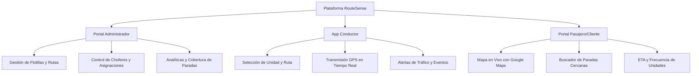

# 🚀 RouteSense: Propuesta Comercial y Modelo de Negocio

## Executive Summary (Resumen Ejecutivo)

**RouteSense** es una plataforma SaaS integral de **Fleet Management & Real-Time Passenger Information System (PIS)** orientada a revolucionar el transporte público, transporte universitario y sistemas privados de transporte de personal.

Mediante una arquitectura de **microservicios de alta disponibilidad en la nube**, integración en tiempo real con **Google Maps Telemetry**, e interfaces web responsivas para Administradores, Conductores y Pasajeros, RouteSense resuelve el problema crítico de la incertidumbre en los tiempos de espera y optimiza la eficiencia operativa de las empresas transportistas.

---

## 🎯 Mercado Objetivo (Target Market)

1. **Empresas Concesionarias de Transporte Público Urbano e Interurbano:**
   - Control centralizado de flotillas, rutas y frecuencias.
   - Reducción de reclamos de usuarios finales y aumento en el uso del transporte.
2. **Instituciones Educativas (Universidades y Colegios):**
   - Monitoreo seguro de autobuses universitarios y rutas de transporte para estudiantes.
3. **Empresas de Transporte Privado de Personal / Corporativo:**
   - Seguimiento exacto para colaboradores de maquiladoras, parques industriales y corporativos.
4. **Gobiernos Municipales e Institutos de Transporte:**
   - Digitalización y supervisión del cumplimiento de concesiones de transporte.

---

## 💡 Propuesta de Valor Diferenciadora (USP)

| Desafío Tradicional | Solución RouteSense | Beneficio Comercial |
| :--- | :--- | :--- |
| **Incertidumbre del Pasajero** | Ubicación del autobús en mapa interactivo en tiempo real. | Incremento de satisfacción del usuario (+40%). |
| **Falta de Control Telemétrico** | Módulo de monitoreo para choferes sin hardware costoso (utiliza smartphone/tablet). | Reducción de costos de CAPEX en equipos GPS dedicados (-70%). |
| **Monolitos Difíciles de Escalar** | Arquitectura modular en 8 microservicios independientes. | Alta disponibilidad (99.9%) y escalabilidad sin caídas. |
| **Mapeo de Rutas Complejo** | Trazado dinámico de paradas, geocercas y estimación de rutas con Google Maps API. | Optimización del tiempo de viaje y frecuencias. |

---

## 💼 Modelos de Monetización y Licenciamiento

### 1. Modelo SaaS (Suscripción Mensual por Autobús)
Ideal para empresas con flotillas activas.

- **Starter Plan ($25 USD / autobús / mes):**
  - Hasta 10 autobuses.
  - Monitoreo GPS en tiempo real.
  - Aplicación para Pasajeros y Choferes.
  - Soporte vía Ticket.
- **Pro Fleet ($45 USD / autobús / mes):**
  - De 11 a 50 autobuses.
  - Todo lo del plan Starter + Dashboard de analíticas avanzadas, gestión multi-empresa y alertas de desvío.
  - Soporte 24/7.
- **Enterprise SaaS ($65 USD / autobús / mes):**
  - Mas de 50 autobuses.
  - Integración personalizada vía API REST, subdominios dedicados y SLA garantizado de 99.9%.

### 2. Licencia Perpetua On-Premise (Venta de Código Fuente / White-Label)
Ideal para gobiernos, grandes corporativos o compradores que desean la propiedad exclusiva del software.

- **Precio Estimado de Licencia Completa:** **$15,000 USD – $30,000 USD** (pago único).
- **Incluye:**
  - Código fuente completo (Frontend React + 8 Microservicios Python/FastAPI + Scripts SQL de base de datos).
  - Derechos de marca blanca (White-Label) para renombrar la aplicación.
  - 3 meses de acompañamiento en despliegue e infraestructura en la nube.
  - Manuales técnicos y documentación de API.

---

## 📊 Matriz de Características por Rol

---

## 📞 Estructura para Pitch Deck de Ventas

Al presentar RouteSense a inversionistas o clientes finales, se recomienda seguir esta estructura de 8 diapositivas:

1. **Portada:** RouteSense - Movilidad Inteligente y Monitoreo en Tiempo Real.
2. **El Problema:** Tiempos de espera a ciegas, falta de control en choferes y pérdida de pasaje.
3. **La Solución:** Demo en vivo de la App Pasajero y Panel Administrador.
4. **Tecnología:** Microservicios escalables, Google Maps API y backend ultra-rápido con FastAPI.
5. **Ahorro de Costos:** No requiere hardware costoso; funciona con smartphones estándar.
6. **Modelo de Negocio:** Tabla de precios SaaS y retorno de inversión (ROI) estimado en 3 meses.
7. **Testimoniales / Casos de Uso:** Implementación en rutas universitarias y transporte de personal.
8. **Cierre & Llamado a la Acción:** Solicita una prueba gratuita de 14 días o cotización personalizada.
