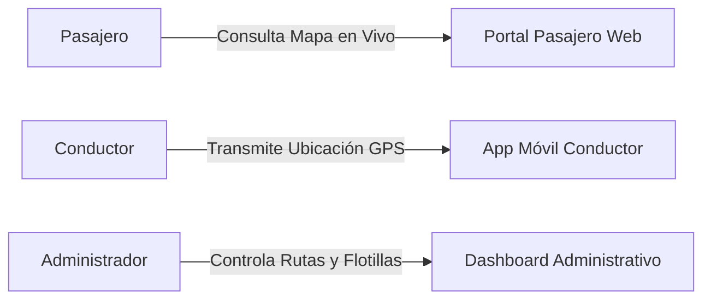

# 📊 RouteSense: Presentación Ejecutiva y Pitch Deck de Ventas

Este documento contiene la estructura completa diapo-por-diapo para presentar **RouteSense** ante clientes potenciales, concesionarios de transporte, directivos de empresas o inversionistas.

---

## 📄 Diapositiva 1: Portada

### 🚌 RouteSense: Plataforma de Movilidad Inteligente y Control de Flotillas
**Subtítulo:** Transformando el transporte urbano y privado con monitoreo telemétrico en tiempo real.

- **Presentado por:** Equipo RouteSense
- **Contacto:** `ventas@routesense.app`
- **Sitio Web:** `https://routesense.app`

> 💡 **Notas del Orador:** *"Buenas tardes a todos. Hoy les presentamos RouteSense, la solución tecnológica integral diseñada para resolver la incertidumbre en los tiempos de espera del transporte y brindarle a las empresas el control absoluto de sus flotillas en tiempo real."*

---

## 📄 Diapositiva 2: El Problema Actual

### 🛑 ¿A qué se enfrentan las empresas de transporte y los usuarios hoy?

1. **Incertidumbre del Pasajero:**
   - Largas e impredecibles esperas en paradas sin saber a qué hora o si pasará la unidad.
   - Pérdida de usuarios que optan por transporte privado o alternativo.
2. **Falta de Control Operativo:**
   - La empresa no sabe dónde están sus autobuses en tiempo real ni si los choferes cumplen las rutas.
   - Dificultad para medir velocidad, frecuencias y tiempos muertos.
3. **Altos Costos de Inversión Inicial (CAPEX):**
   - Los sistemas GPS tradicionales requieren comprar hardware costoso ($300 - $500 USD por unidad) más costos de instalación y mantenimiento físico.

---

## 📄 Diapositiva 3: La Solución RouteSense

### ✨ Una plataforma 360° en tiempo real y sin hardware costoso

- 📍 **Monitoreo en Tiempo Real:** Pasajeros y administradores ven la ubicación exacta de cada unidad sobre Google Maps.
- 📱 **Hardware Cero (CAPEX $0):** Funciona con cualquier smartphone o tablet Android/iOS que ya poseen los choferes.
- ⚡ **Arquitectura de Microservicios:** Alta disponibilidad (99.9%) y capacidad de escalar a miles de vehículos sin ralentizarse.
- 🕒 **Tiempos Estimados de Llegada (ETA):** Cálculo automático de tiempos de arribo a cada parada registrada.

---

## 📄 Diapositiva 4: Las 3 Aplicaciones del Ecosistema

1. **Portal del Pasajero:**
   - Mapa interactivo público, consulta de rutas, paradas cercanas y ETA.
2. **Aplicación del Conductor:**
   - Inicio de turno simple, selección de unidad/ruta y transmisión GPS en background.
3. **Dashboard Administrativo:**
   - Alta de concesionarias, autobuses, choferes, trazado de rutas y auditoría telemétrica.

---

## 📄 Diapositiva 5: Modelos Comerciales (Renta SaaS vs Compra Total)

### 💳 ¿Cómo se puede adquirir RouteSense?

 Ofrecemos **flexibilidad total** adaptada al presupuesto y modelo operativo de cada cliente:

| Criterio | 🔄 Opción 1: Renta (SaaS Suscripción) | 💎 Opción 2: Compra Total (Licencia Perpetua) |
| :--- | :--- | :--- |
| **¿En qué consiste?** | Pago mensual por autobús activo en la plataforma. | Pago único por la propiedad del código fuente y plataforma. |
| **Público Objetivo** | Concesionarios, transporte universitario, flotillas medianas. | Gobiernos, corporativos masivos, marcas blancas (White-Label). |
| **Inversión Inicial** | **$0 USD** (Sin costo de implementación inicial). | **$15,000 – $30,000 USD** (Pago único de contado/cuotas). |
| **Servidores / Nube** | **Incluido** (Nosotros gestionamos la infraestructura). | En servidores del cliente (On-Premise) o nube privada. |
| **Soporte y Cambios** | Actualizaciones continuas y soporte 24/7 incluidos. | 3 meses de acompañamiento + opción a póliza anual. |

---

## 📄 Diapositiva 6: Desglose de Planes y Precios

### 🏷️ 1. Modelo de Renta (SaaS Mensual por Autobús)
- **Plan Starter ($25 USD / autobús / mes):**
  - Hasta 10 autobuses activos.
  - Monitoreo GPS en tiempo real + App Pasajero y Conductor.
- **Plan Pro Fleet ($45 USD / autobús / mes):** *(Recomendado)*
  - De 11 a 50 autobuses.
  - Todo lo del plan Starter + Dashboard de analíticas, alertas de desvío y soporte prioritario.
- **Plan Enterprise ($65 USD / autobús / mes):**
  - Más de 50 autobuses.
  - Subdominio propio, integración vía API REST y SLA garantizado de 99.9%.

---

### 🏷️ 2. Modelo de Compra Total (Licencia Perpetua / Código Fuente)
- **Licencia Full Source Code ($20,000 USD):**
  - Entrega de todo el código fuente (Frontend React 19 + 8 Microservicios FastAPI + Scripts SQL Supabase).
  - Derechos de **Marca Blanca (White-Label)** para renombrar y vender el software bajo su propia marca.
  - Instalación en la infraestructura privada del cliente.

---

### 🏷️ 3. Modelo Híbrido (Licencia Inicial + Mantenimiento Anual)
- **Pago Inicial:** **$8,000 USD** (Licencia de uso ilimitada sin código fuente).
- **Póliza Anual:** **$2,000 USD / año** (Mantenimiento de servidores, parches de seguridad y actualizaciones).

---

## 📄 Diapositiva 7: Beneficios y Retorno de Inversión (ROI)

- 📈 **+35% Aumento en Pasajeros:** La certidumbre atrae a más usuarios que confían en los horarios exactos.
- ⛽ **-20% Ahorro de Combustible:** Reducción de aceleraciones bruscas, paradas no autorizadas y tiempos muertos con motor encendido.
- 💸 **-80% Ahorro en CAPEX Telemétrico:** Elimina la necesidad de comprar cajas GPS dedicadas de $400 USD por camión.
- ⏱️ **Punto de Equilibrio Estimado:** El sistema se paga solo en los primeros **60 a 90 días** de operación.

---

## 📄 Diapositiva 8: Especificaciones Tecnológicas

- **Frontend:** React 19, Vite 8, TailwindCSS, Google Maps JS API.
- **Backend:** 8 Microservicios independientes en FastAPI (Python 3.11).
- **Base de Datos:** PostgreSQL / Supabase.
- **Infraestructura:** Docker & Render Cloud Deployment.

---

## 📄 Diapositiva 9: Próximos Pasos (Llamado a la Acción)

1. 🧪 **Prueba Piloto Gratuita por 14 Días** (hasta 5 autobuses de prueba).
2. 📋 **Cotización Personalizada** según el número de unidades de su flotilla.
3. 🖥️ **Demostración en Vivo** con sus choferes y rutas reales.

**¡Contáctanos hoy para agendar tu demostración!**
- 📧 `ventas@routesense.app`
- 🌐 `https://routesense.app`
