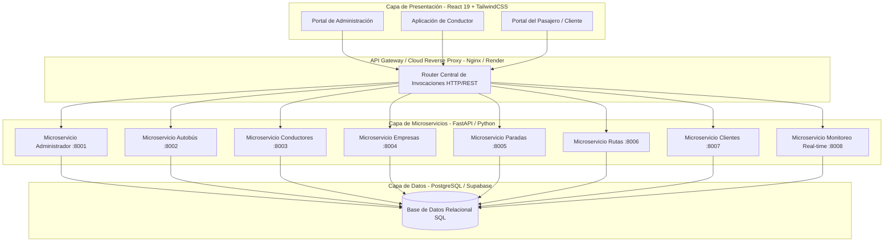
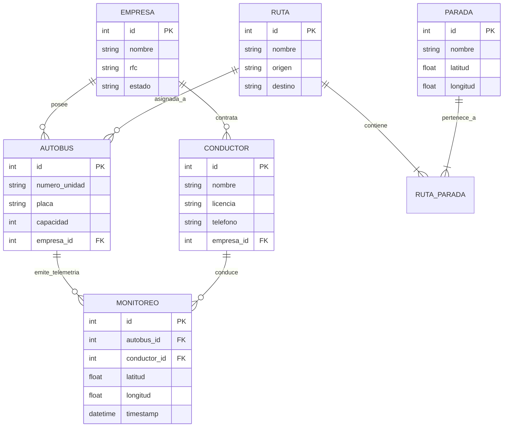
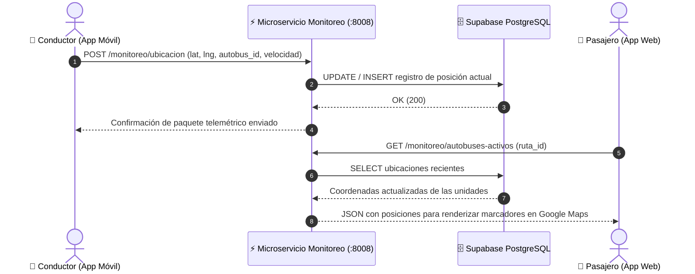

# 🏗️ RouteSense: Arquitectura del Sistema e Ingeniería

## 1. Visión General de la Arquitectura

**RouteSense** utiliza una arquitectura de **microservicios distribuida** desacoplada, donde cada dominio de negocio (Administración, Autobuses, Conductores, Empresas, Paradas, Rutas, Clientes y Monitoreo) opera de forma independiente para garantizar **escalabilidad horizontal, tolerancia a fallos y fácil mantenimiento**.

---

## 2. Detalle de Microservicios de Backend

| Microservicio | Responsabilidad Principal | Modelos de Datos Relevantes |
| :--- | :--- | :--- |
| **`Administrador`** | Gestión de superusuarios, permisos de plataforma y auditorías. | `Administrador`, `Auditoria` |
| **`Autobus`** | Catálogo de unidades de transporte, placas, capacidad y estado operacional. | `Autobus`, `Mantenimiento` |
| **`Conductores`** | Perfiles de choferes, licencia de conducir, estado de disponibilidad y asignaciones. | `Conductor`, `Asignacion` |
| **`Empresas`** | Registro de concesionarias, contratos, razón social y configuración regional. | `EmpresaTransitoria`, `Contrato` |
| **`Paradas`** | Coordenadas latitud/longitud de paradas oficiales, infraestructura y puntos de abordaje. | `Parada`, `Ubicacion` |
| **`Rutas`** | Trazado de trayectos, origen, destino, secuencias de paradas y horarios predeterminados. | `Ruta`, `RutaParada` |
| **`Clientes`** | Gestión de pasaje, autenticación de usuarios finales y preferencias de notificación. | `Cliente`, `Usuario` |
| **`Monitoreo`** | Telemetría GPS en tiempo real, velocidad, estado del trayecto y conexión de choferes. | `MonitoreoGPS`, `UbicacionActual` |

---

## 3. Modelo de Datos y Base de Datos Relacional

El sistema utiliza una base de datos relacional PostgreSQL (vía Supabase / local) organizada con llaves foráneas para mantener integridad referencial.

### Diagrama Entidad-Relación (ERD)

---

## 4. Flujo de Transmisión de Ubicación GPS en Tiempo Real

---

## 5. Decisiones Tecnológicas Destacadas

1. **FastAPI (Python 3.11+):** Elegido por su velocidad de ejecución (competitiva con Node.js y Go), validación automática de esquemas con Pydantic y generación interactiva de documentación OpenAPI (Swagger UI).
2. **React 19 + Vite 8:** Compilación ultra-rápida en desarrollo y bundle de producción optimizado para dispositivos móviles con baja velocidad de conexión.
3. **Google Maps Javascript API (`@react-google-maps/api`):** Proporciona renderizado fluido de capas de vectores, marcadores personalizados de autobuses y cálculo de rutas óptimas con Polyline.
4. **Docker & Render Infrastructure:** Contenedores ligeros basados en `python:3.11-slim` y `node:20-alpine` para garantizar despliegues reproducibles sin inconsistencias de entorno.
