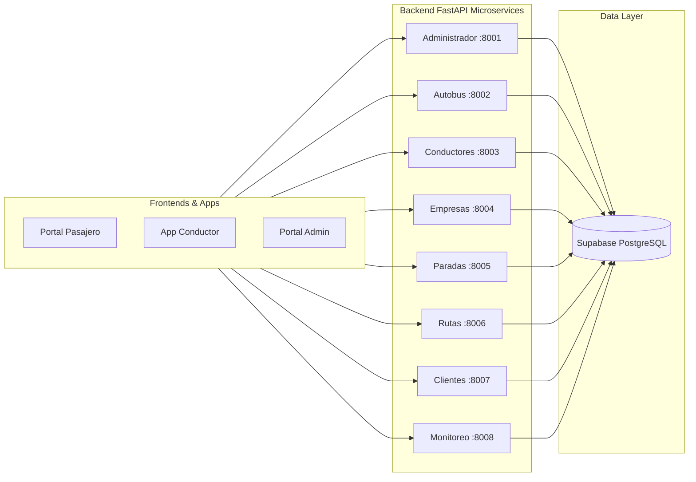

<div align="center">

# 🚌 RouteSense Application
### *Smart Mobility & Real-Time Transport Fleet Management Platform*

[](https://fastapi.tiangolo.com/)
[](https://react.dev/)
[](https://tailwindcss.com/)
[](https://supabase.com/)
[](https://www.docker.com/)
[](https://render.com/)
[](./LICENSE)

*Plataforma integral SaaS para el rastreo en tiempo real, gestión de flotillas de transporte público/privado y optimización de movilidad urbana.*

[Propuesta Comercial](./DOCS/COMMERCIAL_OFFERING.md) • [Presentación Diapositivas](./DOCS/PITCH_DECK.md) • [Manual de Usuario](./DOCS/USER_MANUAL.md) • [Guía de Despliegue](./DOCS/DEPLOYMENT_GUIDE.md) • [Arquitectura](./DOCS/SYSTEM_ARCHITECTURE.md) • [Referencia API](./DOCS/API_REFERENCE.md)

---
</div>

## 🌟 Visión General del Producto

**RouteSense** es una solución tecnológica completa diseñada para eliminar la incertidumbre en el transporte urbano y corporativo. La plataforma conecta en tiempo real a **Administradores de Flotillas**, **Conductores** y **Pasajeros** mediante un ecosistema de microservicios distribuido en la nube e integrado con la API de Google Maps.

### Key Highlights (Puntos Clave):
- 📍 **Rastreo Telemétrico GPS en Vivo:** Visualización sin latencia de unidades en circulación.
- 🏢 **Multi-Empresa & Concesionarias:** Control centralizado de empresas transportistas, contratos y asignaciones.
- 📱 **Sin Hardware Especializado (CAPEX Cero):** Los choferes transmiten telemetría directamente desde dispositivos móviles estándar.
- ⚡ **Microservicios de Alta Escalabilidad:** Backend modular construido con FastAPI y PostgreSQL/Supabase.
- 🗺️ **Mapeo Dinámico de Rutas y Paradas:** Geolocalización inteligente con Google Maps JavaScript API.

---

## 📐 Arquitectura de Microservicios

El sistema está dividido en 8 microservicios independientes desacoplados y una aplicación web responsiva (React 19):



---

## 🎯 Portales y Funcionalidades por Rol

| Portal / Rol | Descripción y Funcionalidades Clave |
| :--- | :--- |
| **👨‍💼 Administrador** | Dashboard de analíticas, alta de unidades, choferes, empresas, trazado de rutas en mapa y auditoría de eventos en tiempo real. |
| **🚘 Conductor** | Interfaz móvil simplificada para iniciar/finalizar turnos, seleccionar ruta/autobús y transmitir coordenadas GPS de manera continua. |
| **📱 Pasajero / Cliente** | Mapa público interactivo en vivo, localización de unidades en tiempo real, buscador de paradas cercanas y estimación de llegada. |

---

## 📁 Estructura del Repositorio

```text
RouteSenseApplication/
├── AppArchitecture/              # Diagramas conceptuales y activos de diseño
│   ├── Arquitectura de Aplicacion (RouteSense).png
│   └── Logo App.png
├── Backend/                      # Microservicios en FastAPI & Dockerfiles
│   ├── Administrador/            # Gestión de superusuarios y auditoría
│   ├── Autobus/                  # Catálogo de unidades y mantenimiento
│   ├── Clientes/                 # Autenticación y perfil de usuarios pasajeros
│   ├── Conductores/              # Perfiles y asignaciones de choferes
│   ├── Empresas/                 # Registro de empresas concesionarias
│   ├── Monitoreo/                # Telemetría y coordenadas GPS en tiempo real
│   ├── Paradas/                  # Coordenadas y catálogo de paradas
│   ├── Rutas/                    # Secuencia de trayectos y paradas
│   └── .env.example              # Plantilla de variables de entorno para backend
├── DataBaseProject/              # Esquemas SQL de PostgreSQL / Supabase
│   ├── seguridad_schema.sql
│   ├── usuarios.sql
│   ├── operacion.sql
│   ├── transporte.sql
│   └── monitoreo.sql
├── Frontend/                     # Aplicación Web (React 19 + Vite 8 + Tailwind)
│   ├── src/                      # Componentes, vistas, layouts y rutas
│   ├── .env.example              # Plantilla de variables de entorno frontend
│   └── package.json
├── DOCS/                         # Suite de Documentación Comercial y Técnica
│   ├── COMMERCIAL_OFFERING.md    # Modelo de negocios, precios SaaS y propuesta de valor
│   ├── PITCH_DECK.md             # Estructura de Diapositivas Diapo-por-Diapo (Markdown)
│   ├── PITCH_PRESENTATION.html   # Diapositivas Interactivas en HTML5 (Listo para presentar)
│   ├── SYSTEM_ARCHITECTURE.md    # Especificaciones de ingeniería y diagramas ERD
│   ├── DEPLOYMENT_GUIDE.md       # Guía de instalación en Render, Docker y Supabase
│   ├── USER_MANUAL.md            # Manual de operación para Admin, Chofer y Pasajero
│   └── API_REFERENCE.md          # Referencia completa de Endpoints REST
├── docker-compose.yml            # Orquestación local multicontenedor
├── render.yaml                   # Definición de Blueprints para despliegue en Render Cloud
├── .gitignore                    # Reglas de ignorado de Git
└── LICENSE                       # Licencia comercial y aviso de derechos de autor
```

---

## 🚀 Inicio Rápido (Quick Start Local)

### Con Docker Compose (Recomendado):

1. Clona este repositorio:
   ```bash
   git clone https://github.com/tu-usuario/RouteSenseApplication.git
   cd RouteSenseApplication
   ```

2. Configura las variables de entorno:
   ```bash
   cp Frontend/.env.example Frontend/.env
   cp Backend/.env.example Backend/.env
   ```

3. Enciende toda la plataforma:
   ```bash
   docker-compose up -d --build
   ```

4. Abre tu navegador en:
   - **Frontend App:** `http://localhost:3000`
   - **API Docs (Monitoreo):** `http://localhost:8008/docs`

---

## 📚 Centro de Documentación

Para obtener información detallada sobre la venta, arquitectura o instalación, consulta los siguientes documentos de la carpeta [`DOCS/`](./DOCS/):

1. 📊 **[Presentación Ejecutiva Interactiva (HTML5)](./DOCS/PITCH_PRESENTATION.html):** Presentación de diapositivas animada lista para abrir en el navegador.
2. 📝 **[Guion de Diapositivas (Pitch Deck Markdown)](./DOCS/PITCH_DECK.md):** Diapositiva por diapositiva con contenido, tablas y notas del orador.
3. 💼 **[Propuesta Comercial y Modelo de Negocio](./DOCS/COMMERCIAL_OFFERING.md):** Planes SaaS, cotización de marca blanca y ROI.
4. 🏗️ **[Arquitectura e Ingeniería del Sistema](./DOCS/SYSTEM_ARCHITECTURE.md):** Diagramas de secuencia, diagrama Entidad-Relación (ERD) y stack técnico.
5. 🌐 **[Guía de Despliegue en la Nube](./DOCS/DEPLOYMENT_GUIDE.md):** Instrucciones paso a paso para Render.com, Docker VPS y Supabase.
6. 📖 **[Manual de Usuario Operativo](./DOCS/USER_MANUAL.md):** Guía práctica de uso para Administradores, Choferes y Pasajeros.
7. 🔌 **[Referencia de API REST](./DOCS/API_REFERENCE.md):** Especificación completa de endpoints por microservicio.

---

## 📄 Licencia y Propiedad Intelectual

Este proyecto se distribuye bajo términos de **Licencia Comercial Privada**. Para adquisición de derechos de uso, licencias White-Label o instalación On-Premise para empresas de transporte, consulta el archivo [`LICENSE`](./LICENSE) o contacta a `sales@routesense.app`.

*Desarrollado con ❤️ para transformar la movilidad e innovación tecnológica en el transporte.*
